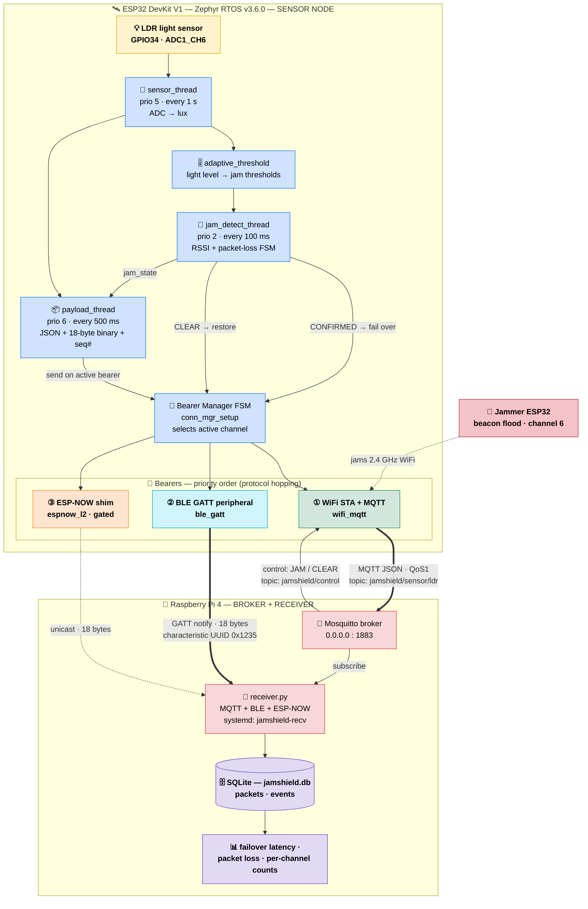
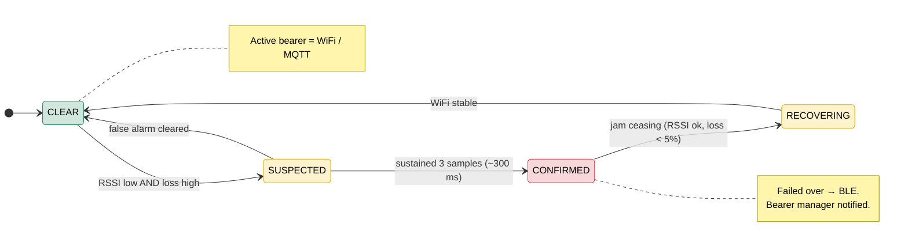
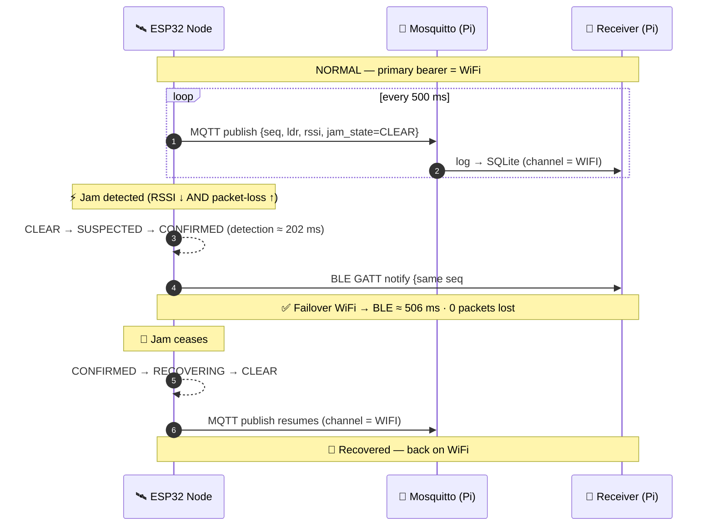

# JamShield

**Jamming-resilient IoT sensor node with automatic protocol hopping.**
ESP32 DevKit V1 (Zephyr RTOS v3.6.0) + Raspberry Pi 4 receiver.

An ESP32 reads an LDR light sensor and streams it over **WiFi/MQTT** (primary).
When it detects WiFi jamming, it fails over automatically to **BLE GATT**
(secondary) and **ESP-NOW** (tertiary), then restores WiFi when the jam clears.
A Raspberry Pi 4 receives on all three channels and logs everything to SQLite
for analysis.

See [PRD.md](PRD.md) for the full design and [CLAUDE.md](CLAUDE.md) for the
phase plan.

---

## 🗺️ System Architecture & How It Works

### 1) System data flow — sensor node ➜ three radios ➜ Raspberry Pi



### 2) Jamming-detection state machine (runs every 100 ms, priority 2)



### 3) Failover timeline (measured on hardware)



### 📖 Definitions of technical terms

**Platform & software**
- **ESP32** — a low-cost dual-core microcontroller with built-in 2.4 GHz WiFi and Bluetooth; the sensor node.
- **Zephyr RTOS** — a real-time operating system. An **RTOS** runs tasks with *guaranteed timing*, unlike a normal OS.
- **Thread** — an independent unit of execution. **Thread priority** decides who runs first; lower number = more urgent (jam detection is priority 2, the most urgent app thread).
- **FSM (Finite State Machine)** — logic that is always in exactly one named *state* (e.g. CLEAR, CONFIRMED) and moves between them on defined events.
- **WCET (Worst-Case Execution Time)** — the mathematically-bounded longest time an operation can take; used to *prove* the failover is fast enough (≤ 325 ms here).
- **systemd service** — a background program the Pi starts automatically on boot and restarts if it crashes (our `jamshield-recv` receiver).
- **SQLite** — a small self-contained database stored in a single file (`jamshield.db`).

**Sensing**
- **LDR (Light Dependent Resistor)** — a resistor whose resistance changes with light; our light sensor.
- **ADC (Analog-to-Digital Converter)** — converts the LDR's analog voltage into a number (0–4095, 12-bit).
- **lux** — the unit of light intensity (how bright it is).
- **Adaptive threshold** — the jamming sensitivity is *adjusted* based on the LDR reading (a brighter, busier room has noisier radio, so thresholds relax to avoid false alarms).

**Wireless & jamming**
- **RSSI (Received Signal Strength Indicator)** — how strong the WiFi signal is, in dBm (e.g. −46 = strong, −85 = weak).
- **Packet loss** — the fraction of sent messages that were not acknowledged; rises sharply under jamming.
- **Jamming** — deliberately flooding a radio channel with noise so real traffic can't get through.
- **Beacon flood** — a jamming technique that spams fake WiFi "beacon" frames on a channel (what the second ESP32 jammer does).
- **Dual-metric detection** — we require *both* low RSSI *and* high packet loss before declaring a jam, to avoid false positives.
- **Hysteresis** — using a *higher* bar to declare recovery than to declare a jam, so the system doesn't flip-flop on the boundary.

**Networking**
- **WiFi STA (station mode)** — the ESP32 acting as a normal client that joins a WiFi router (vs. *AP* mode where it would *be* the router).
- **DHCP** — the protocol that automatically hands the ESP32 its IP address when it joins the WiFi.
- **MQTT** — a lightweight **publish/subscribe** messaging protocol for IoT.
- **Broker** — the central MQTT server (**Mosquitto**) that relays messages; runs on the Pi at `:1883`.
- **Topic** — a named channel messages are published to (`jamshield/sensor/ldr` for data, `jamshield/control` for JAM/CLEAR commands).
- **Publish / Subscribe** — senders *publish* to a topic; receivers *subscribe* to it. They never talk directly.
- **QoS (Quality of Service)** — MQTT delivery guarantee; **QoS 1** = "at least once," with an acknowledgement (PUBACK) we use to measure packet loss.
- **Payload** — the actual data in a message (here JSON over WiFi, or a compact 18-byte binary struct over BLE/ESP-NOW).
- **Sequence number (seq#)** — a counter on every packet; gaps reveal lost packets, and it stays continuous across a failover (proving no data loss).

**Bluetooth & ESP-NOW**
- **BLE (Bluetooth Low Energy)** — low-power Bluetooth; the secondary fallback channel.
- **GATT** — the BLE data model of *services* and *characteristics*.
- **Peripheral / Central** — the ESP32 is the **peripheral** (advertises + serves data); the Pi is the **central** (connects + reads).
- **Characteristic / UUID** — a single data item in GATT, identified by a UUID (our sensor data = `0x1235`).
- **Notification** — a BLE push: the peripheral sends new data to the central without being polled.
- **ESP-NOW** — Espressif's connectionless radio protocol (no WiFi association needed); the tertiary fallback, hardest to jam.

**Failover concepts**
- **Bearer** — any link that can carry our data (WiFi, BLE, or ESP-NOW). The **Bearer Manager** picks which one is active.
- **conn_mgr (Connectivity Manager)** — the Zephyr subsystem we use to watch WiFi link health; our app-level manager extends the idea to BLE/ESP-NOW.
- **Failover** — automatically switching to the next-best bearer when the current one fails.
- **Recovery** — switching back to the higher-priority bearer (WiFi) once the jam clears.
- **Detection latency** — time from jam onset to a confirmed jam (≈ 202 ms measured).
- **Failover latency** — time from the last WiFi packet to the first packet on the fallback channel (≈ 506 ms measured).

---

## Status — VERIFIED END-TO-END ON HARDWARE ✅

| Component | State |
|---|---|
| WSL2 Zephyr toolchain (west, SDK 0.16.8, xtensa, RF blobs) | ✅ installed |
| ESP32 firmware (LDR, WiFi+MQTT, jam-detect, BLE, bearer FSM, payload) | ✅ builds clean, **runs on real ESP32** |
| WiFi → MQTT → SQLite pipeline | ✅ **317 WIFI packets logged on the Pi** |
| Jamming detection FSM | ✅ **detection latency 202 ms** (within the 325 ms WCET bound) |
| WiFi → BLE failover | ✅ **506–594 ms**, BLE packets reach the Pi (**224 BLE packets**) |
| BLE → WiFi recovery | ✅ auto-recovers (`Jamming CEASING` → `WiFi RESTORED`) |
| RPi4 receiver (MQTT + BLE → SQLite) | ✅ running as `jamshield-recv` systemd service |
| Mosquitto broker on Pi | ✅ active on `0.0.0.0:1883` |
| ESP-NOW tertiary bearer | ⚙️ written, gated `CONFIG_JS_ESPNOW=n` (HAL present; DRAM-bound) |
| Jammer board, formal experiments, paper | ⏸ needs 2nd ESP32 / data collection |

### Deployed topology (LAN variant)
ESP32, laptop, and Pi all join the home WiFi **`Loki`** (2.4 GHz). The Pi runs
the Mosquitto broker at **`10.88.34.137:1883`** and the receiver. (The PRD's
dedicated-AP topology needs a USB WiFi dongle or ethernet on the Pi for
management — deferred; see notes.)

### Manual failover trigger (for demos / experiments)
Publish to the control topic to exercise the real failover FSM:
```bash
mosquitto_pub -h 10.88.34.137 -t jamshield/control -m JAM     # WiFi -> BLE
mosquitto_pub -h 10.88.34.137 -t jamshield/control -m CLEAR   # recover (or auto-expires after 15s)
```

### Flashing — from Windows over COM (no usbipd needed)
usbipd proved unreliable on this machine, so the firmware is flashed directly
with Windows esptool on the CP210x COM port:
```powershell
wsl -d Ubuntu -- bash -lc "bash ~/jamshield_bootstrap/build.sh auto && tr -d '\r' < /mnt/c/Workspace/IotELL/scripts/copy_flash.sh | bash"
python -m esptool --chip esp32 -p COM6 -b 460800 write_flash --flash_size detect `
  0x1000 flash\bootloader.bin 0x8000 flash\partition-table.bin 0x10000 flash\zephyr.bin
python scripts\capture_win.py COM6 16          # serial monitor (resets board on open)
```

> ⚠️ **Security note:** `src/esp32/include/jamshield.h` currently hardcodes the
> WiFi SSID/password. Parameterize or gitignore before committing/sharing.

---

## Layout

```
src/esp32/      Zephyr application (C) — the firmware
  include/      module headers
  src/          main.c, sensor_ldr.c, jam_detect.c, adaptive_threshold.c,
                wifi_mqtt.c, ble_gatt.c, espnow_l2.c, conn_mgr_setup.c,
                payload_thread.c
  boards/       esp32_devkitc_wroom.overlay (LDR on GPIO34/ADC1_CH6, LED, wifi)
  prj.conf      Kconfig    Kconfig (CONFIG_JS_ESPNOW)    CMakeLists.txt   west.yml
src/rpi4/       Python receiver/logger (receiver.py, database.py, ble_receiver.py,
                espnow_receiver.py, jammer_control.py, setup_rpi4.sh, requirements.txt)
scripts/        build.sh, flash.sh, monitor.sh, and one-time bootstrap scripts
.vscode/        build / flash / monitor tasks (invoke WSL from Windows VSCode)
```

## Build environment

Source lives on Windows (`c:\Workspace\IotELL`, presentable & VSCode-editable);
the build runs inside **WSL2 Ubuntu** against `~/jamshield_workspace` (Zephyr
v3.6.0) with a fast WSL-native build dir `~/jamshield_build/esp32`. Env vars are
in `~/jamshield_env.sh` (sourced from `~/.bashrc`).

### Build
```powershell
# From Windows (PowerShell) — or use VSCode task "Build JamShield ESP32"
wsl -d Ubuntu -- bash -lc "bash ~/jamshield_bootstrap/build.sh auto"
```
The bootstrap scripts under `scripts/` were used once to install the toolchain;
`build.sh` is the everyday command (`auto` = incremental, `always` = pristine).

## Flashing (when the ESP32 is connected)

1. Plug the ESP32 into USB.
2. In **Windows PowerShell (Admin)**:
   ```powershell
   usbipd list                      # find the "CP210x" / "CH340" bus id, e.g. 2-4
   usbipd bind   --busid <id>        # once per device
   usbipd attach --wsl --busid <id>  # makes /dev/ttyUSB0 appear in WSL
   ```
3. Flash + monitor (VSCode tasks "Flash ESP32" / "Monitor Serial", or):
   ```powershell
   wsl -d Ubuntu -- bash -lc "tr -d '\r' < /mnt/c/Workspace/IotELL/scripts/flash.sh | bash"
   wsl -d Ubuntu -- bash -lc "tr -d '\r' < /mnt/c/Workspace/IotELL/scripts/monitor.sh | bash"
   ```
   On first WSL use you may need `sudo usermod -aG dialout $USER` then reopen WSL.

Expected serial output: `==== JamShield starting ====`, LDR readings each
second, WiFi/MQTT connect logs, and `FAILOVER`/state messages under jamming.

## Raspberry Pi 4

```bash
# copy src/rpi4 to the Pi, then:
chmod +x setup_rpi4.sh && ./setup_rpi4.sh      # AP + Mosquitto + venv (reboot after)
source ~/jamshield_env/bin/activate
python3 receiver.py                            # all channels -> data/jamshield.db
```

---

## Engineering notes (deviations from the PRD draft, and why)

These are deliberate, documented choices so the system actually builds and runs
on real Zephyr 3.6 — the PRD's C listings are illustrative pseudocode.

- **Application-level bearer manager instead of custom `conn_mgr` bearers.**
  Zephyr's `conn_mgr` only abstracts `net_if`-backed L2s (WiFi here). BLE GATT
  and ESP-NOW are not network interfaces, so `conn_mgr_setup.c` implements the
  WiFi→BLE→ESP-NOW failover as a clean app-level FSM with one `send()` entry
  point — exactly what the PRD's own payload-thread dispatch implies. WiFi L4
  health still comes from `conn_mgr`/`net_mgmt` events.
- **ESP-NOW gated behind `CONFIG_JS_ESPNOW` (default off).** The Espressif
  `esp_now.h` HAL *is* present in this port and `libespnow.a` is fetched, so the
  real implementation in `espnow_l2.c` can be enabled — but DRAM is already at
  ~93%, so turning it on needs further RAM trimming first. With it off, the
  module is a compile-safe stub and WiFi↔BLE failover is fully functional.
- **Static heaps trimmed** (`HEAP_MEM_POOL_SIZE`, `MBEDTLS_HEAP_SIZE`, net
  buffers) to fit ESP32 DRAM with WiFi+BLE coexisting.
- **Integer-only math in all threads** (fixed-point lux ×10), no `malloc` in
  threads, sequence numbers + `k_uptime_get()` timestamps on every packet — per
  the CLAUDE.md hard rules.
- **`dtc` not installed** (non-fatal — Zephyr uses its own DTS parser).
```
